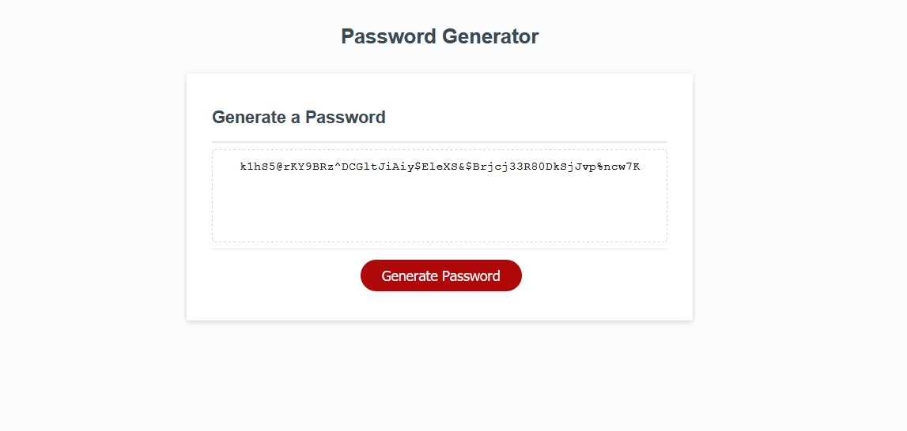

# Password--Generator

This task was to create a password generator with the knowldge of JaveScript we learned in module 3.

The interface gives you the option to generate a password between 8-128 characters, and between the choices of Capital, Lowercase, Special characters, or Numbers.

# Link to Page

https://tonofclay93.github.io/Password--Generator/

# Screen shot

